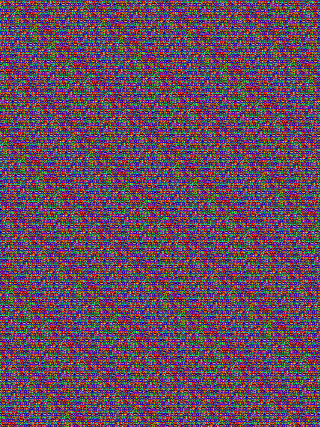

# Tuenti Challenge X

These are my solutions to [Tuenti Challenge X](https://contest.tuenti.net/).
During the contest, I managed
to solve problems 1-18. Unfortunately, I didn't manage to see a quick way
to identify the unique cow in problem 19, and I *never* skip (I prefer
to be stuck on a problem until I figure it out or until the end of times).

In the future maybe I'll upload solutions to p19 and p20, to feel
self-accomplished.

Here I do a small write-up for each of the problems, although for
the most difficult problems the important documentation is in the comments of
my code. Feel free to dig in.

## P1

There isn't much to say, really. Perhaps the only note worth mentioning is that
I didn't want to implement an ugly bunch of conditionals, so I initialized a
matrix where the (i,j) entry is the winner between gestures i and j.
Well, actually I didn't want to implement a mapping from gestures to integers,
so instead of a matrix is an std::map that takes a (char,char) whose image
is the char representing the winner.

## P2

You can define a graph where the nodes are the players and each (u,v) edge
means that player u beats player v. Perhaps it's obvious now that you can
do topological sorting to sort the players from best to worst. However, since
we are interested only in the top player, we can just pick the node with zero
in degree.

## P3

Well, the problem statement tells you pretty much what you must do, so it's just
a matter of implementing it. From the code, I read the book file once line by line
and preprocess it to obtain:

* a dictionary from words to the number of occurrencies in the text
* a dictionary from words to their rank (when sorted from most frequent to least frequent)
* the sorted list of words (for the rank queries)

All the words with less than 3 characters are discarded, of course. I use
regular expressions to substitute all the undesired characters (i.e. the
complement of the "abcdefghijklmnñopqrstuvwxyzáéíóú" set) by spaces.

## P4

If the pre-production environment gets updated each Monday with the contents
for the next week, then it means that this week it already contains the key for
the game. Pre-production is isolated, but shares load balancer with
production. Therefore, we can trick the load balancer to believe that it must
return the response for the pre-production environment changing the Host field
in the GET request (and that's indeed what we do in the code).

## P5

The smallest tuentistic number is 20, so it makes sense to think that, for any
number, the largest tuentistic sum will contain numbers in the 20-29 range.

We first calculate how many 20s are necessary to compose N (N/20). Then, we
calculate how much we need to sum to reach N (because N won't be in general
a multiple of 20). This remainder (N%20) ranges from 0 to 19, so we try to
split it among the 20s. If there is one operand that should receive an offset of
more than 9, then it's impossible to compose N as a tuentistic sum. Examples:

* Any number less than 20 cannot be composed by a tuentistic sum.
* Any number from 30 to 39 cannot be composed by a tuentistic sum (because
  it'll be a 20 plus some number greater than 9)
* 59 cannot be written as a tuentistic sum, because we can use at most
  two 20s, and the remainder (19) cannot be splitted in a way that both
  operands are less than 30 (one operand must be 29 and the other 30).

## P6

This is a partially observable maze. I initialize a socket that interacts
with the server reading the current view of the maze and sending my command.
I defined a coordinate system in which my initial position is (0,0). I don't
maintain an explicit grid. Instead, I store all the known locations for
obstacles in a set. We know the location of the princess since the very
beginning, so I iteratively plan the shortest route (with BFS) to reach her given
the currently known locations for obstacles and my current position. Of course,
the set of discovered obstacles is updated at each iteration. There are
two potential optimizations that could be made to my code: A\* instead of
plain BFS (maybe this speeds things up a little, and maybe not because most
of the difficulty comes from the fact that the location of obstacles is unknown),
and keeping the path calculated in the previous iteration(s) if it's still
valid.

## P7

Funny, I couldn't quite remember the title and composer of the musical piece
(which is shameful, in hindsight) so I started approaching the problem blind.
I could've probably solved it the
hard way because I suspected (and I was right) that it was a substitution code.
None of the online decrypters that I found could work with punctuation marks,
so before going full throttle and implementing my own substitution code breaker,
I tried to see the hint in the melody. I identified some of the notes and
searched for the melody [here](https://www.musipedia.org/). So yeah, it's the
New World Symphony by Dvořák. Everything falls in place: the message is typed
in a Dvorak keyboard as if it were a QWERTY one. We do the mapping
from one keyboard to the other and we use it to decrypt the messages.

## P8

Classical CTF steganography, just
```
strings 05-headache.png
```
Some brainfuck code at the end. Put it in some Brainfuck interpreter. Done.

## P9

The core of the challenge is mostly in understanding the Bash script, which
is almost as bad as Perl or PHP.

The encryption consists in xor'ing the message with the reversed key (so
the message and the key must be of the same length), sort of
a one-time-pad... but used twice. So yeah, you can get the key xor'ing the
known (plaintext,ciphertext) pair and reversing the result. Then you simply
decrypt the target ciphertext using the key you just got.

## P10

Well, this is a virtual Escape Room in which you use Unicode emojis
instead of text commands. Each icon is actually a classical Linux command:
the flashlight is `ls`, the "shout" icon is `echo`, the `bag` icon is an
`ls` of the `/game/bag/` folder (if I remember correctly), the `walk` icon
is the `cd` command... Later on, following the quest, you acquire a magnifying
glass that is the `cat` command. Curiously enough, you don't actually need
this because you can show the contents of a file with the `echo` command
(e.g. `echo "$(<file.txt)"`).

What can I say? You just follow the quest line until you acquire the key.
There are some geeky puzzles:

* With Elliot the zombie you have to solve a chinese-remainder-theorem-but-not-quite
  type of problem (this is the only part I wrote some code for).
* You have to wake up the Geenie softly, so don't Ctrl+C him. Instead, Ctrl+Z
  him.
* The vampire's poem is written in the toilet paper, so you should read its
  contents (either acquire the magnifying glass from the merperson or use the
  echo trick).
* At some point you have to find something that is very well hidden, so
  you need `(FLASHLIGHT ICON) -A`.
* They will tell you that some ladybug was lost in a toilet hole. You cannot
  list the content of that directory, so you must grab it directly (look for
  the ladybug emoji).

## P11

This problem can be solved with Dynamic Programming. In fact, it reminds me
quite a bit of the [Coin Change](https://www.geeksforgeeks.org/coin-change-dp-7/)
problem. I really like DP, so I didn't take much time to figure this one out.
Essentially I define a function C(x,i) that means "number of ways of summing x
with operands {o\_i, o\_{i+1}, o\_{M-1}} where O = {o\_0, ..., o\_{M-1}} is the
set of available operands (with o\_i < o\_{i+1}). Then it gets really easy to
write down the recurrence and the base cases (check my code for more details,
it's explained in more detail here).

## P12

In RSA, the ciphered message is c = m^e (mod N). Equivalently,
c = k\*N + m^e for some integer k that we don't know. Thus,
c - m^e = k\*N. Since we have two messages:

* c1 - m1^e = k1\*N
* c2 - m2^e = k2\*N

If we knew e, gcd(c1-m1^e, c2-m2^e) = C\*N, for C = gcd(k1,k2). If we're lucky
C = 1. If we're less lucky, C is some (hopefully small) integer.

I took a shameful amount of time to solve this problem, because it didn't occurred
to me that e (the exponent of RSA) was usually picked to be 65537. I thought
that there was no reason this had to be the case for this problem, so I iterated
through several values of e. Once I acknowledged the fact that e was
probably 65537, it was piece of cake (also, we were lucky, we got N directly).
Check the code for more inline documentation.

## P13

Given H0, W0 and D0 (height, width and depth of the center tower) we can
calculate in O(H0) time the number of packs in the whole fortress. I believe
there's a closed form polynomial formula for the number of packs, but I didn't
want to spend much time figuring it out. I could observe that the number of
packs grows as the cube of H0 (check data.ods for a visual), so in any case we
won't need more than 2^21 iterations (because that would be more than
2^62 packages, which is
the maximum size of the input for this problem). We can do binary search to
find the value of H0 such as the number of packs in a H0x1x1 tower is just
below the number of available packs. Then we do binary search again on
W0 and D0 to find the maximum size for the tower. In hindsight, probably binary
search for W0 and D0 was an overkill, since once H0 is pinpointed, W0, D0 cannot
be too big.

A few observations that are useful for calculating the number of packs:

* The number of packs in the tower is W0\*D0\*H0
* The contour of the tower is C\_0 = 2\*(W0+D0) - 4
* The contour of layer i is C\_i = C\_(i-1) + 8 = C\_0 + 8\*i
* The number of packs in a layer i with i > 0 is C\_i\*H\_i.

Also, a nice piece of trivia: the sequence 0,2,1,4,3,6,4,... (which is related
to the H\_i values) is [known](http://oeis.org/A030451).

As always, more details in the code's comments.

## P14

The Paxos protocol is detailed [here](https://en.wikipedia.org/wiki/Paxos_(computer_science)).
Also, a Sybil attack targets systems based on reputation. So "Sybil System" isn't
just a reference to psycho-pass (great manga/anime, btw), but also a hint (or
maybe it's just a reference and Sybil is used in the original series to convey
the same idea about reputation). Anyway, in Paxos you gain reputation (or more
like "leadership" points) by proposing tasks to which the rest of the nodes
commit to. In this problem, you cannot declare yourself the secret owner, but
you can propose tasks, gain reputation, and gain leadership points that you
can use to kick out other nodes and introduce whatever other node you want.
The other nodes can be you from different connections, so you just connect
with different clients, until you and your other clients are the only nodes
remaining in the cluster. Then the system is forced to give the secret to any
of your nodes.

My code is very messy, and I really didn't take advantage of the other clients
(they just sit there doing nothing), so sometimes it fails if it's not lucky.
To make it better, each client should be contributing to the overall goal in a
different thread. Oh well, it's good enough :)

## P15

Do not try to uncompress the tar file. The files contain just zeroes, so
you only need the (uncompressed) size of each of the archived files. I use
the libarchive C library to navigate through the archive and gather their
sizes. After the additions, the DNA sequences will be very sparse, so we
only need:

* A way to combine the CRC32 of two chunks of data.
* A way to compute the CRC32 of a bunch of zeroes

Both can be accomplished through the magic of the crc32\_combine function that
comes implemented in zlib.

* crc32\_combine takes the crc32 of the the first part of the data, the
  crc32 of the second part of the data, and the length of the second part
  of the data to compute the crc32 of the whole data.
* CRC32(N zeros) can be calculated very similarly to fast exponentiation 

Check my code for more info.

## P16

Fun one. The problem can be expressed as a MILP (Mixed-Integer Linear Problem).
We define integer variables WC\_g\_f that mean "number of WCs assigned to
group g in floor f" (for each f that is allowed to g). Then we define a
real variable M that is going to be the maximum number of used toilets per floor.

Then, for each floor f we have a constraint "Sum(WC\_g\_f for each g that can access f) <= M".

For each group g we have a constraint "Sum(WC\_g\_f for each f available to g) >= E\_g",
where E\_g is the number of employees that belong to g.

The objective is to minimize M.

We won't need to force the integrality of M thanks to the constraints
and the objective function.

We use the pulp Python library to solve the problem.

## P17

Steganography challenge. First I figured out that I have to reassemble the
image.


It's common to hide the message in the last bit(s)
of each pixel value. The following image confirms that there's something funny
going on with those last bits (reassembled image and'ed with a matrix of all
1's and multiplied by 255).



We traverse the pixels by column, row and channel, collect the last
bit of each value, and put it in a buffer. The buffer (when grouping bits in
chunks of 8 and interpreting it as ASCII) reads:

CONGRATULATIONS, YOU FOUND THE HIDDEN MESSAGE, WILL YOU BE ABLE TO DECODE IT? E2A089E2A095E2A09DE2A09BE2A097E2A081E2A09EE2A0A5E2A087E2A081E2A09EE2A08AE2A095E2A09DE2A08E20E2A0BDE2A095E2A0A520E2A099E2A091E2A089E2A095E2A099E2A091E2A09920E2A09EE2A093E2A09120E2A08DE2A091E2A08EE2A08EE2A081E2A09BE2A09120E2A09EE2A093E2A09120E2A08FE2A081E2A08EE2A08EE2A0BAE2A095E2A097E2A09920E2A08AE2A08E20E2A09EE2A093E2A09120E2A08BE2A095E2A087E2A087E2A095E2A0BAE2A08AE2A09DE2A09B20E2A0BAE2A095E2A097E2A09920E2A08AE2A09D20E2A0A5E2A08FE2A08FE2A091E2A097E2A089E2A081E2A08EE2A09120E2A09EE2A081E2A085E2A091E2A08EE2A093E2A08AE2A085E2A08AE2A09EE2A081E2A09DE2A095E2A083E2A08AE2A09EE2A095E2A09EE2A081E2A085E2A091E2A08EE2A093E2A08AE2A093E2A0A5E2A08DE2A095E2A097E2A081E2A08DE2A081E2A097E2A08AE2A087E2A087E2A095E2A0BCE2A083E2A0BCE2A09AE2A0BCE2A083E2A0BCE2A09AE2A09EE2A0A5E2A091E2A09DE2A09EE2A08AE2A089E2A093E2A081E2A087E2A087E2A091E2A09DE2A09BE2A091E2A0BCE2A081E2A0BCE2A09A

The last part of the message looks like hexadecimal. We interpret it as Unicode
and the following message appears:

⠉⠕⠝⠛⠗⠁⠞⠥⠇⠁⠞⠊⠕⠝⠎ ⠽⠕⠥ ⠙⠑⠉⠕⠙⠑⠙ ⠞⠓⠑ ⠍⠑⠎⠎⠁⠛⠑ ⠞⠓⠑ ⠏⠁⠎⠎⠺⠕⠗⠙ ⠊⠎ ⠞⠓⠑ ⠋⠕⠇⠇⠕⠺⠊⠝⠛ ⠺⠕⠗⠙ ⠊⠝ ⠥⠏⠏⠑⠗⠉⠁⠎⠑ ⠞⠁⠅⠑⠎⠓⠊⠅⠊⠞⠁⠝⠕⠃⠊⠞⠕⠞⠁⠅⠑⠎⠓⠊⠓⠥⠍⠕⠗⠁⠍⠁⠗⠊⠇⠇⠕⠼⠃⠼⠚⠼⠃⠼⠚⠞⠥⠑⠝⠞⠊⠉⠓⠁⠇⠇⠑⠝⠛⠑⠼⠁⠼⠚

Fine, Braile. If we translate it (I used [this](https://www.dcode.fr/braille-alphabet)),
the translated message reads

CONGRATULATIONS YOU DECODED THE MESSAGE THE PASSWORD IS THE FOLLOWING WORD IN UPPERCASE TAKESHIKITANOBITOTAKESHIHUMORAMARILLO2020TUENTICHALLENGE10

And we're done!!

## P18

This is the last problem I managed to do during the competition week. I solved
it with dynamic programming. I defined a function EditCost(i, b, c, d, e)
that means "Edit cost of editing subsequence i..N, when there is at least one
comma in the current line, there are c open brackets, if d a literal may follow,
and if e a new bracket can be open". Instead of using a table and fill it
it progressively, I used memoization and a cache of previously computed values
in Python. It's probably much slower in runtime, but it's much quicker to type.

